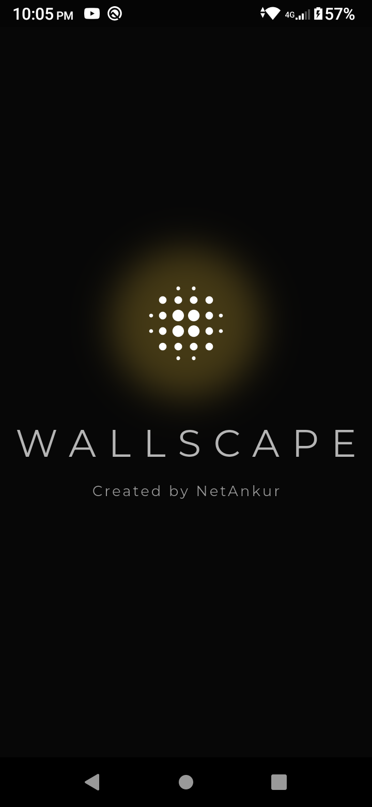
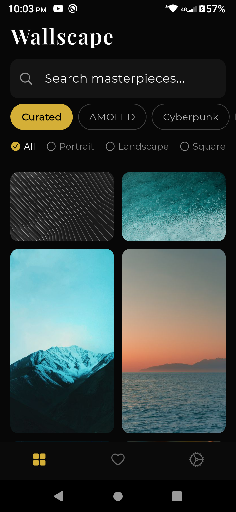
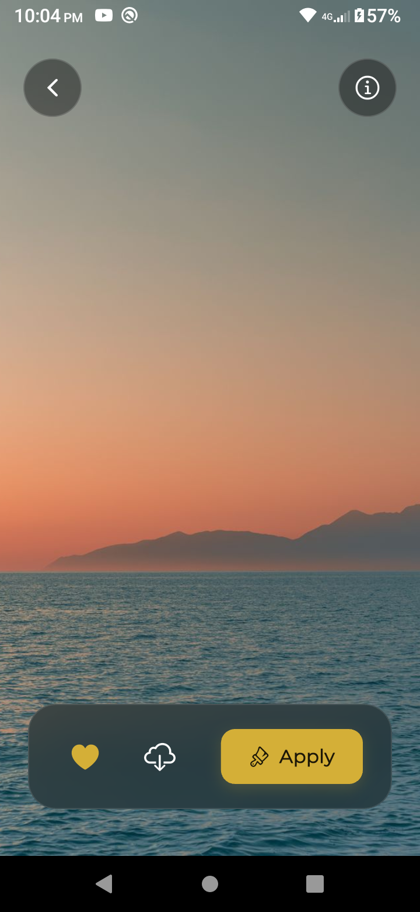
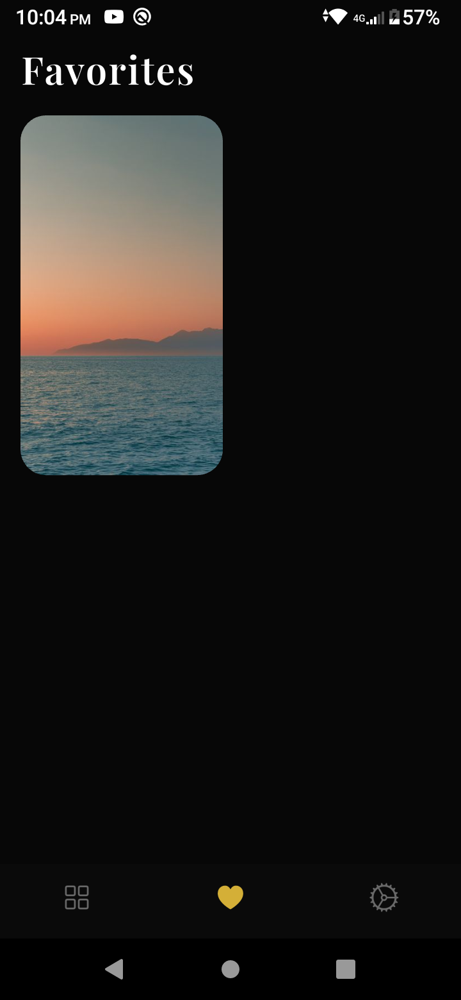
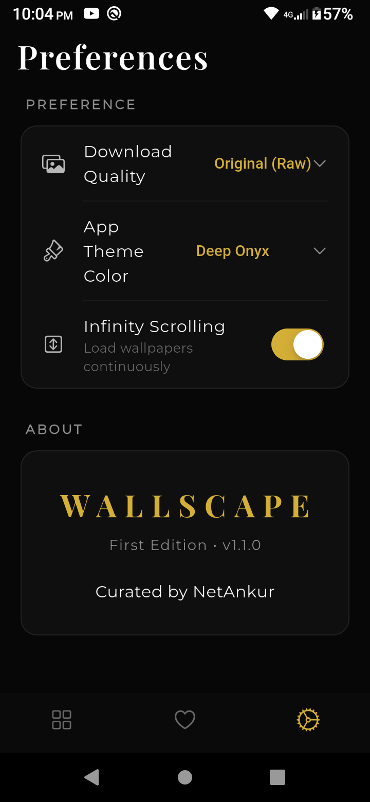

<div align="center">
  
  
  # Wallscape 🌅
  
  **A beautiful, fluid, and immersive wallpaper experience for Android.**
  
  [](https://flutter.dev)
  [](https://dart.dev)
</div>

---

## 📱 About Wallscape

Wallscape is a modern, lightweight Android application designed to let you discover and apply stunning high-resolution wallpapers effortlessly. Built from the ground up with **Flutter**, it features a gorgeous distraction-free dark mode design, buttery smooth masonry grid scrolling, and one-tap wallpaper setup.

📸 Screenshots

<div align="center">
  <table>
    <tr>
      <td></td>
      <td></td>
      <td></td>
      <td></td>
      <td></td>
    </tr>
  </table>
</div>

## ✨ Key Features

- **Endless Discovery**: Browse thousands of hand-picked, high-quality wallpapers in an infinite masonry layout.
- **One-Tap Apply**: Set any image as your home screen or lock screen instantly using native Android APIs.
- **High Resolution**: Enjoy only the highest quality images perfectly cropped for your device.
- **Save to Gallery**: Download your favorite wallpapers directly to your phone for later use.
- **Dark Theme**: A sleek, minimal user interface that puts the artwork front and center.

## 🚀 Getting Started

Want to run Wallscape on your own machine? Follow these steps:

1. **Clone the repository:**
   ```bash
   git clone https://github.com/netankur/wallscape.git
   cd wallscape
   ```
2. **Install dependencies:**
   ```bash
   flutter pub get
   ```
3. **Run the app on a connected device/emulator:**
   ```bash
   flutter run
   ```
   *(To test a release build, use `flutter run --release`)*

## 🛠️ Built With

- **[Flutter](https://flutter.dev/)** - UI Toolkit
- **[flutter_staggered_grid_view](https://pub.dev/packages/flutter_staggered_grid_view)** - Responsive masonry layout
- **[cached_network_image](https://pub.dev/packages/cached_network_image)** - Advanced image caching
- **[async_wallpaper](https://pub.dev/packages/async_wallpaper)** - Native Android wallpaper management
- **[gal](https://pub.dev/packages/gal)** - Saving images to native gallery

## 📄 License

This project is licensed under the MIT License - see the [LICENSE](LICENSE) file for details.